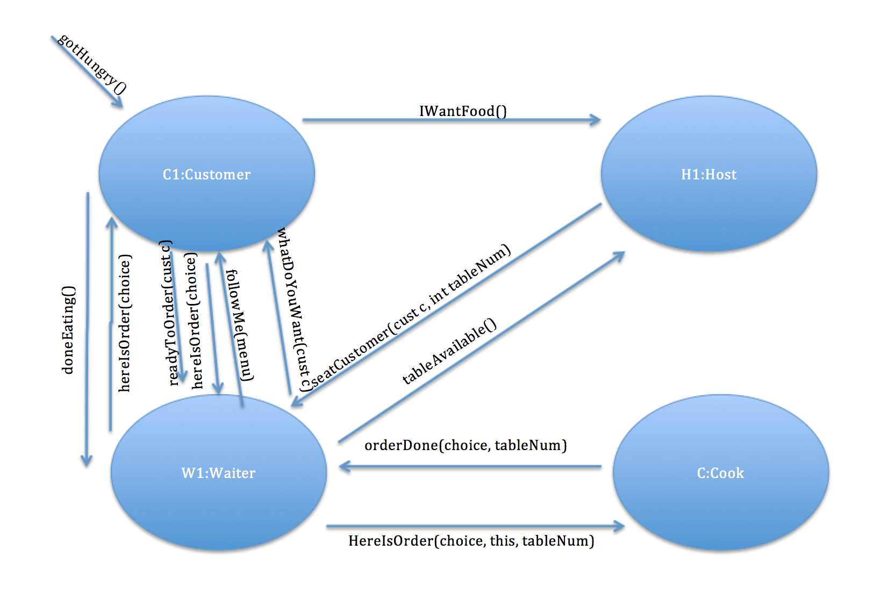

# Grant's CS201 Restaurant Design Doc

This document outlines the crucial parts of each main agent in the restaurant: HostAgent, WaiterAgent, CookAgent, and CustomerAgent.



Links to all agents on this page directly:
[Market][]

## Host Agent

### Data
```
	static final int NTABLES = 4
	public List<CustomerAgent> waitingCustomers
	public List<MyWaiter> myWaiters
	public Collection<Table> tables
	private String name
	public WaiterGui hostGui = null
	String carryingOrderText = ""
```
### Scheduler
```
	if (!waitingCustomers.isEmpty() && checkAllTablesOccupied() == true) {
			waitingCustomers.get(0).restaurantFull()
			waitingCustomers.remove(0)
			return true
		}
		for (Table table : tables) {
			if (!table.isOccupied()) {
				if (!waitingCustomers.isEmpty()) {
					seatCustomer(waitingCustomers.get(0), table)
					return true
				}
			}
		}
		for (MyWaiter waiter : myWaiters) {
			if (waiter.state == WaiterState.wantBreak){
				processBreakRequest(waiter)
				return true
			}
		}
		return false
```

### Messages
```
	public void msgIWantFood(CustomerAgent cust) {
		waitingCustomers.add(cust)
		stateChanged()
	}
```
```
	public void msgLeavingTable(CustomerAgent cust) {
		for (Table table : tables) {
			if (table.getOccupant() == cust) {
				table.setUnoccupied()
				stateChanged()
			}
		}
	}
```
```
	public void wantBreak(WaiterAgent w){
		for (MyWaiter waiter : myWaiters) {
			if (waiter.waiter.equals(w)){
				waiter.state = WaiterState.wantBreak
			}
		}
		stateChanged()
	}
```
```
	public void decrementCustomer(WaiterAgent w){
		for (MyWaiter waiter : myWaiters) {
			if (waiter.waiter.equals(w)){
				waiter.numCustomers--
			}
		}
		stateChanged()
	}
```
```
	public void returnedFromBreak(WaiterAgent w){
		for (MyWaiter waiter : myWaiters) {
			if (waiter.waiter.equals(w)){
				waiter.state = WaiterState.none
			}
		}
		stateChanged()
	}
```
### Actions
```
	private void seatCustomer(CustomerAgent customer, Table table) {
		if (myWaiters.size() != 0) {
			int init_cust = myWaiters.get(0).numCustomers
			MyWaiter w_selected = null
			for (MyWaiter w : myWaiters){
				if (w.numCustomers <= init_cust && w.isOnBreak() == false){
					init_cust = w.numCustomers
					w_selected = w
				}
			}
			w_selected.waiter.msgSeatCustomer(customer, table.tableNumber, this)
			w_selected.numCustomers++
			table.setOccupant(customer)
			waitingCustomers.remove(customer)
		}
	}
```
```
	public void processBreakRequest(MyWaiter w){
		int onBreakNow = getNumWaitersOnBreak()
		if (myWaiters.size() <= 1 || (onBreakNow == myWaiters.size() - 1)){
			w.waiter.breakRejected()
			w.state = WaiterState.none
		} else {
			w.waiter.breakApproved()
			w.state = WaiterState.onBreak
		}
	}
```

## Waiter Agent

### Data
```
	static final int DEFAULT_BREAK_TIME = 15000
	static final int HOMEPOS_X = 230
	static final int HOMEPOS_Y = 230
	public List<MyCustomer> myCustomers
	public HostAgent myHost
	public CookAgent myCook
	private String name
	public CashierAgent myCashier
	private boolean onBreak
	private WaiterGui waiterGui
	private Semaphore isAnimating = new Semaphore(0,true)
	Timer breakTimer
	public enum AgentState {DoingNothing, wantBreak, onBreak}
	public enum AgentEvent {none, breakRequested, breakApproved, breakRejected}
```

### Scheduler
```
		if (state == AgentState.wantBreak && event == AgentEvent.none){
			requestBreakFromHost()
			return true
		}
		if (state == AgentState.wantBreak && event == AgentEvent.breakApproved){
			state = AgentState.onBreak
			beginBreak()
			return true
		}
		
		if (state == AgentState.wantBreak && event == AgentEvent.breakRejected){
			processBreakRejection()
			return true
		}
		for (MyCustomer c : myCustomers) {
			if (c.state == CustomerState.Waiting){
				seatCustomer(c)
				return true
			}
		}
		for (MyCustomer c : myCustomers) {
			if (c.state == CustomerState.ReadyToOrder){
				takeOrder(c, c.tableNum)
				return true
			}
		}
		for (MyCustomer c : myCustomers) {
			if (c.state == CustomerState.OrderedWaiting){
				sendToKitchen(c, c.choice)
				return true
			}
		}
		for (MyCustomer c : myCustomers) {
			if (c.state == CustomerState.FoodReady){
				deliverOrder(c, c.choice)
				return true
			}
		}
		for (MyCustomer c : myCustomers) {
			if (c.state == CustomerState.Done){
				goodbyeCustomer(c)
				return true
			}
		}
		for (MyCustomer c : myCustomers) {
			if (c.state == CustomerState.NeedNewChoice){
				repickFood(c)
				return true
			}
		}
		for (MyCustomer c : myCustomers) {
			if (c.state == CustomerState.wantCheck){
				requestCheckForCustomer(c)
				return true
			}
		}
		for (MyCustomer c : myCustomers) {
			if (c.state == CustomerState.needCheckDelivered){
				deliverCheck(c)
				return true
			}
		}
		goHome()
		return false
```

### Messages
```
	public void doneEating(CustomerAgent c) {
		for (MyCustomer cust : myCustomers) {
			if (cust.customer.equals(c)){
				cust.state = CustomerState.Done
			}
		}
		stateChanged()
	}
```
```
	public void hereIsFood(int tableNum, String choice) {
		for (MyCustomer cust : myCustomers) {
			if (cust.tableNum == tableNum){
				cust.state = CustomerState.FoodReady
			}
		}
		stateChanged()
	}
```
```
	public void msgSeatCustomer(CustomerAgent c, int tableNum, HostAgent h) {
		myHost = h
		MyCustomer customer = new MyCustomer()
		customer.customer = c
		customer.tableNum = tableNum
		myCustomers.add(customer)
		stateChanged()
	}
```
```
	public void readyToOrder(CustomerAgent c) {
		for (MyCustomer cust : myCustomers) {
			if (cust.customer.equals(c)){
				cust.state = CustomerState.ReadyToOrder
			}
		}
		stateChanged()
	}
```
```
	public void hereIsMyChoice(String choice, CustomerAgent c) {
		for (MyCustomer cust : myCustomers) {
			if (cust.customer.equals(c)){
				cust.choice = choice
				cust.state = CustomerState.OrderedWaiting
			}
		}
		stateChanged()
	}
```
```
	public void ImDone(CustomerAgent c) {
		for (MyCustomer cust : myCustomers) {
			if (cust.customer.equals(c)){
				cust.state = CustomerState.Done
			}
		}
		stateChanged()
	}
```
```
	public void needNewChoice(int tableNum, String choice) {
		for (MyCustomer cust : myCustomers) {
			if (cust.tableNum == tableNum){
				cust.state = CustomerState.NeedNewChoice
			}
		}
		stateChanged()
	}
```
```
	public void breakApproved(){
		state = AgentState.onBreak
		event = AgentEvent.breakApproved
		onBreak = true
		stateChanged()
	}
```
```
	public void breakRejected(){
		onBreak = false
		state = AgentState.wantBreak
		event = AgentEvent.breakRejected
		stateChanged()
	}
```
```
	public void requestBreak(){
		state = AgentState.wantBreak
		event = AgentEvent.none
		stateChanged()
	}
```
```
	public void hereIsCheck(CustomerAgent c, double checkAmount){
		for (MyCustomer cust : myCustomers) {
			if (cust.customer.equals(c)){
				cust.payAmount = checkAmount
				cust.state = CustomerState.needCheckDelivered
			}
		}
		stateChanged()
	}
```
```
	public void readyForCheck(CustomerAgent c){
		for (MyCustomer cust : myCustomers) {
			if (cust.customer.equals(c)){
				cust.state = CustomerState.wantCheck
			}
		}
		stateChanged()
	}

```

### Actions
```
private void takeOrder(MyCustomer c, int tableNum){
		waiterGui.setDestination(c.customer.getGui().getX(), c.customer.getGui().getY())
		waiterGui.beginAnimate()
		try {
			isAnimating.acquire()
		} catch (InterruptedException e) {
			e.printStackTrace()
		}
		c.customer.msgWhatDoYouWant()
		c.state = CustomerState.Ordering
	}
```
```
	private void sendToKitchen(MyCustomer c, String choice){
		c.state = CustomerState.WaitingForFood
		waiterGui.setDestination(500, 230)
		waiterGui.beginAnimate()
		try {
			isAnimating.acquire()
		} catch (InterruptedException e) {
			e.printStackTrace()
		}
		myCook.hereIsOrder(choice, this, c.tableNum)
	}
```
```
	public void seatCustomer(MyCustomer c){
		waiterGui.setDestination(-20, -20)
		waiterGui.beginAnimate()
		try {
			isAnimating.acquire()
		} catch (InterruptedException e) {
			e.printStackTrace()
		}
		
		c.customer.msgSitAtTable(new Menu(), this)
		
		int destX = 0, destY = 0
		
		for (Table t : myHost.getTables()) {
			if (c.tableNum == t.tableNumber){
				destX = t.tableX
				destY = t.tableY
			}
		}
		
		c.customer.getGui().setDestination(destX, destY)
		
		waiterGui.setDestination(destX, destY)
		waiterGui.beginAnimate()
		
		try {
			isAnimating.acquire()
		} catch (InterruptedException e) {
			e.printStackTrace()
		}
		
		c.state = CustomerState.Seated
		
	}
```
```
	public void deliverOrder(MyCustomer c, String choice){
		
		waiterGui.setDestination(500, 230)
		waiterGui.beginAnimate()
		
		try {
			isAnimating.acquire()
		} catch (InterruptedException e) {
			e.printStackTrace()
		}
		
		String carryText = ""
		
		switch(choice){
		case "Chicken":
			carryText = "CHK"
			break
		case "Mac & Cheese":
			carryText = "M&C"
			break
		case "French Fries":
			carryText = "FRF"
			break
		case "Pizza":
			carryText = "PZA"
			break
		case "Pasta":
			carryText = "PST"
			break
		case "Cobbler":
			carryText = "CBL"
			break
		}
		
		waiterGui.setCarryText(carryText)
		waiterGui.setDestination(c.customer.getGui().getX(), c.customer.getGui().getY())
		waiterGui.beginAnimate()
		
		try {
			isAnimating.acquire()
		} catch (InterruptedException e) {
			e.printStackTrace()
		}
		
		c.customer.hereIsOrder(choice)
		c.state = CustomerState.Eating
		waiterGui.setCarryText("")
		
	}
```
```
	public void goodbyeCustomer(MyCustomer c){
		myCustomers.remove(c)
		myHost.decrementCustomer(this)
		c.customer.getHost().msgLeavingTable(c.customer)
	}
```
```
	private void goHome(){
		waiterGui.setDestination(HOMEPOS_X, HOMEPOS_Y)
	}
```
```
	private void repickFood(MyCustomer c){
		Menu newMenu = new Menu()
		newMenu.removeItem(c.choice)
		c.customer.repickFood(newMenu)
		c.state = CustomerState.Ordering
	}
```
```
	private void deliverCheck(MyCustomer c){
		double needToPay = 0
		needToPay = c.payAmount
		c.customer.hereIsCheck(needToPay)
		c.state = CustomerState.payingCheck
	}
```
```
	private void requestCheckForCustomer(MyCustomer c){
		myCashier.calculateCheck(this, c.customer, c.choice)
		c.state = CustomerState.waitingForCheck
	}
```
```
	private void requestBreakFromHost(){
		myHost.wantBreak(this)
		event = AgentEvent.breakRequested
		state = AgentState.wantBreak
		waiterGui.requestedBreak()
	}
```
```
	private void processBreakRejection(){
		waiterGui.breakRejected()
		state = AgentState.DoingNothing
		event = AgentEvent.none
	}
```
```
	private void beginBreak(){
		waiterGui.breakApproved()
		breakTimer.setRepeats(false)
		breakTimer.restart()
		breakTimer.start()
		event = AgentEvent.none
	}
```

## Customer Agent

### Data
```
	static final int DEFAULT_HUNGER_LEVEL = 3500
	static final int DEFAULT_SIT_TIME = 5000
	static final int DEFAULT_CHOOSE_TIME = 5000
	static final int ORDER_ATTEMPT_THRESHOLD = 3
	private String name
	private String choice
	private int hungerLevel = DEFAULT_HUNGER_LEVEL
	Timer eatingTimer
	Timer choosingTimer
	private CustomerGui customerGui
	private double money
	private double needToPay
	private int orderAttempts
	private WaiterAgent assignedWaiter
	private Menu myMenu
	private HostAgent host
	private CashierAgent cashier
	public enum AgentState {DoingNothing, WaitingForSeat, BeingSeated, Seated, Ordering, WaitingForFood, Eating, Leaving, Choosing, CalledWaiter, RequestedCheck, Paying, restaurantFull, CantPay}
	public enum AgentEvent {none, gotHungry, followHost, begunEating, doneEating, doneLeaving, doneChoosing, seated, wantWaiter, receivedCheck, notPaid}
	private Semaphore isAnimating = new Semaphore(0,true)
```
### Scheduler
```
if (state == AgentState.DoingNothing && event == AgentEvent.gotHungry){
			state = AgentState.WaitingForSeat
			goToRestaurant()
			return true
		}
		if (state == AgentState.WaitingForSeat && event == AgentEvent.followHost){
			state = AgentState.BeingSeated
			SitDown()
			return true
		}
		if (state == AgentState.BeingSeated && event == AgentEvent.seated){
			state = AgentState.Choosing
			beginChoosing()
			return true
		}
		if (state == AgentState.Choosing && event == AgentEvent.wantWaiter){
			tellWaiterReady()
			return true
		}
		if (state == AgentState.CalledWaiter && event == AgentEvent.doneChoosing){
			sendChoiceToWaiter()
			state = AgentState.WaitingForFood
			return true
		}
		if (state == AgentState.Eating && event == AgentEvent.doneChoosing){
			beginEating()
			event = AgentEvent.begunEating
			return true
		}		
		if (state == AgentState.DoingNothing && event == AgentEvent.doneEating){
			state = AgentState.Leaving
			sendReadyForCheck()
			return true
		}
		if (state == AgentState.RequestedCheck && event == AgentEvent.receivedCheck){
			leaveRestaurant()
			return true
		}
		if (state == AgentState.Leaving && event == AgentEvent.doneLeaving){
			state = AgentState.DoingNothing
			event = AgentEvent.none
			return true
		}
		if (state == AgentState.Paying && event == AgentEvent.none){
			sendPayment()
			state = AgentState.Leaving
			event = AgentEvent.doneLeaving
			return true
		}
		if (state == AgentState.WaitingForFood && event == AgentEvent.doneLeaving){
			state = AgentState.DoingNothing
			event = AgentEvent.none
			return true
		}
		if (state == AgentState.CantPay && event == AgentEvent.notPaid){
			shame()
			state = AgentState.DoingNothing
			event = AgentEvent.none
			return true
		}
		if (state == AgentState.restaurantFull && event == AgentEvent.gotHungry){
			determineIfStay()
			event = AgentEvent.none
			return true
		}
		return false
```

### Messages
```
	public void gotHungry() {
		print("I'm hungry.")
		event = AgentEvent.gotHungry
		stateChanged()
	}
```
```
	public void msgSitAtTable(Menu m, WaiterAgent w) {
		print("Received msgSitAtTable.")
		myMenu = m
		assignedWaiter = w
		event = AgentEvent.followHost
		stateChanged()
	}
```
```
	public void msgWhatDoYouWant() {
		print("Received msgWhatDoYouWant.")
		event = AgentEvent.doneChoosing
		stateChanged()
	}
```
```
	public void hereIsOrder(String choice) {
		print("Received food choice " + choice + ".")
		state = AgentState.Eating
		stateChanged()
	}
```
```
	public void msgAnimationFinishedGoToSeat() {
		stateChanged()
	}
```
```
	public void msgAnimationFinishedLeaveRestaurant() {
		event = AgentEvent.doneLeaving
		stateChanged()
	}
```
```
	public void repickFood(Menu newMenu) {
		myMenu = newMenu
		state = AgentState.BeingSeated
		event = AgentEvent.seated
		stateChanged()
	}
```
```
	public void dispenseChange(double newMoney) {
		money = newMoney
		stateChanged()
	}
```
```
	public void hereIsCheck(double amountDue) {
		needToPay = amountDue
		event = AgentEvent.receivedCheck
		stateChanged()
	}
```
```
	public void goToCorner() {
		state = AgentState.CantPay
		event = AgentEvent.notPaid
		stateChanged()
	}
```
```
	public void restaurantFull(){
		state = AgentState.restaurantFull
		stateChanged()
	}
```

### Actions
```
	private void tellWaiterReady(){
		assignedWaiter.readyToOrder(this)
		state = AgentState.CalledWaiter
	}
```
```
	private void sendReadyForCheck(){
		assignedWaiter.readyForCheck(this)
		state = AgentState.RequestedCheck
	}
```
```
	private void sendChoiceToWaiter(){
		
		if (choice.equals("")) {
			leaveAbruptly()
			return
		}
		
		if (orderAttempts > ORDER_ATTEMPT_THRESHOLD){
			leaveAbruptly()
			return
		}
		
		assignedWaiter.hereIsMyChoice(choice, this)
		orderAttempts++
		
		String carryText = ""
		switch(choice){
		case "Chicken":
			carryText = "CHK"
			break
		case "Mac & Cheese":
			carryText = "M&C"
			break
		case "French Fries":
			carryText = "FRF"
			break
		case "Pizza":
			carryText = "PZA"
			break
		case "Pasta":
			carryText = "PST"
			break
		case "Cobbler":
			carryText = "CBL"
			break
		}
		customerGui.setCarryText(carryText + "?")
	}
```
```
	private void beginChoosing(){
		choosingTimer.setRepeats(false)
		choosingTimer.restart()
		choosingTimer.start()
	}
```
```
	private void goToRestaurant() {
		host.msgIWantFood(this)
	}
```
```
	private void SitDown() {
		customerGui.beginAnimate()
		try {
			isAnimating.acquire()
		} catch (InterruptedException e) {
			e.printStackTrace()
		}
		event = AgentEvent.seated
	}
```
```	
	private void beginEating() {
		String carryText = ""
		switch(choice){
		case "Chicken":
			carryText = "CHK"
			break
		case "Mac & Cheese":
			carryText = "M&C"
			break
		case "French Fries":
			carryText = "FRF"
			break
		case "Pizza":
			carryText = "PZA"
			break
		case "Pasta":
			carryText = "PST"
			break
		case "Cobbler":
			carryText = "CBL"
			break
		}
		customerGui.setCarryText(carryText)
		eatingTimer.setRepeats(false)
		eatingTimer.restart()
		eatingTimer.start()
	}
```
```
	private void leaveRestaurant() {
		customerGui.setCarryText("")
		customerGui.DoExitRestaurant()
		assignedWaiter.ImDone(this)
		orderAttempts = 0
		state = AgentState.Paying
		event = AgentEvent.none
	}
```
```
	private void leaveAbruptly() {
		customerGui.setCarryText("")
		customerGui.DoExitRestaurant()
		assignedWaiter.ImDone(this)
		orderAttempts = 0
		event = AgentEvent.doneLeaving
	}
```
```
	private void sendPayment(){
		cashier.acceptPayment(this, money)
	}
```
```
	private void determineIfStay(){
		Random random = new Random()
	    boolean willStay = random.nextBoolean()
		
	    if (willStay == true){
	    	state = AgentState.DoingNothing
	    	event = AgentEvent.gotHungry
	    	host.msgIWantFood(this)
	    } else {
	    	state = AgentState.DoingNothing
	    	event = AgentEvent.none
	    	customerGui.resetNotHungry()
	    }
		
	}
```

## Cook Agent

### Data
```
	private String name
	private List<Order> currentOrders
	private List<MarketAgent> myMarkets
	Hashtable<String, FoodItem> allFood
	private static final int REORDER_THRESHOLD = 2
	private static final int MARKETS_NUM = 2
```
### Scheduler
```
		if (!currentOrders.isEmpty()) {
			for (Order order : currentOrders) {
				if (order.getStatus() == orderStatus.ready) {
					orderDone(order)
					return true
				} else if (order.getStatus() == orderStatus.waiting){
					prepareFood(order)
					return true
				} else if (order.getStatus() == orderStatus.bounceBack) {
					orderOut(order)
				} else {
					return true
				}
			}
		}
		return false
```

### Messages
```
public void hereIsOrder(String choice, WaiterAgent waiter, int tableNum) {
		if (allFood.get(choice).quantity >= 1) {
			Order o = new Order()
			o.foodItem = choice
			o.requestingWaiter = waiter
			o.recipTable = tableNum
			currentOrders.add(o)
			stateChanged()
		} else {
			Order o = new Order()
			o.foodItem = choice
			o.requestingWaiter = waiter
			o.recipTable = tableNum
			o.status = orderStatus.bounceBack
			currentOrders.add(o)
			stateChanged()
		}
	}
```
```
	public void deliverFood(String incomingFood, int quantity) {
		FoodItem f = allFood.get(incomingFood)
		if (quantity < f.requestedQuantity && f.searchMarket != MARKETS_NUM){
			f.searchMarket++
		}
		int currentFoodQuantity = f.quantity
		int newFoodQuantity  = currentFoodQuantity + quantity
		f.quantity = newFoodQuantity
		f.reorderSent = false
	}
```

### Actions
```
	private void prepareFood(Order o){
		o.status = orderStatus.preparing
		o.setCooking(allFood.get(o.getFoodName()).cookingTime)
		allFood.get(o.foodItem).decrementQuantity()
		if (allFood.get(o.foodItem).quantity <= REORDER_THRESHOLD && allFood.get(o.foodItem).reorderSent == false){
			int orderQuantity = allFood.get(o.foodItem).maxCapacity - allFood.get(o.foodItem).quantity
			myMarkets.get(allFood.get(o.foodItem).searchMarket).orderFood(this, o.foodItem, orderQuantity)
			allFood.get(o.foodItem).requestedQuantity = orderQuantity
		}
	}
```
```
	private void orderDone(Order o){
		o.getWaiter().hereIsFood(o.recipTable, o.foodItem)
		currentOrders.remove(o)
	}
```
```
	private void orderOut(Order o){
		o.getWaiter().needNewChoice(o.recipTable, o.foodItem)
		currentOrders.remove(o)
	}
```

<a id="market"></a>
## Market Agent

### Data
```
	private String name
	private List<MarketOrder> currentMarketOrders
	Hashtable<String, Integer> inventoryCount
	private static final int DEFAULT_ORDER_FULFILL_TIME = 5000

```
### Scheduler
```
		if (!currentMarketOrders.isEmpty()) {
			for (MarketOrder order : currentMarketOrders) {
				if (order.getStatus() == orderStatus.ready) {
					orderDone(order)
					return true
				} else if (order.getStatus() == orderStatus.waiting){
					prepareOrder(order)
					return true
				}
			}
		}
		return false
```

### Messages
```
	public void orderFood(CookAgent c, String foodToMarketOrder, int quantity) {
		MarketOrder o = new MarketOrder()
		o.foodItem = foodToMarketOrder
		o.requestingCook = c
		o.quantityRequested = quantity
		currentMarketOrders.add(o)
		stateChanged()
	}
```

### Actions
```
	private void prepareOrder(MarketOrder o){
		o.status = orderStatus.preparing
		int foodInventoryCount = inventoryCount.get(o.foodItem)
		if (o.quantityRequested > foodInventoryCount){
			o.deliverableQuantity = foodInventoryCount
		} else {
			o.deliverableQuantity = o.quantityRequested
		}
		inventoryCount.put(o.foodItem, foodInventoryCount - o.deliverableQuantity)
		o.setFulfilling(DEFAULT_ORDER_FULFILL_TIME)
	}
```
```
	private void orderDone(MarketOrder o){
		o.getCook().deliverFood(o.foodItem, o.deliverableQuantity)
		currentMarketOrders.remove(o)
	}
```

## Cashier Agent

### Data
```
	private String name
	private List<Check> myChecks
	private double checkAmount

```
### Scheduler
```
		if (!myChecks.isEmpty()) {
			for (Check check : myChecks) {
				if (check.getStatus() == checkStatus.pending) {
					processCheckToWaiter(check)
					return true
				}
			}
		}
		return false
```

### Messages
```
	public void calculateCheck(WaiterAgent w, CustomerAgent c, String choice){
		Check newCheck = new Check(w, c, choice)
		myChecks.add(newCheck)
		stateChanged()
	}
```
```
	public void acceptPayment(CustomerAgent c, double amountPaid){
		if (!myChecks.isEmpty()) {
			for (Check check : myChecks) {
				if (check.customer.equals(c)){
					processCustomerPayment(c, amountPaid, check)
				}
			}
		}
		stateChanged()
	}
```

### Actions
```
	public void processCheckToWaiter(Check c){
		Menu myMenu = new Menu()
		checkAmount = myMenu.getPriceofItem(c.choice)
		c.amount = checkAmount
		c.status = checkStatus.calculated
		WaiterAgent w = c.waiter
		w.hereIsCheck(c.customer, c.amount)
	}
```
```
	public void processCustomerPayment(CustomerAgent customer, double amountPaid, Check c){
		if (amountPaid == c.amount){
			c.status = checkStatus.paid
		} else if (amountPaid > c.amount){
			customer.dispenseChange(amountPaid - c.amount)
			c.status = checkStatus.paid
		} else if (amountPaid < c.amount){
			customer.goToCorner()
		}
	}
```